# MDI Ally

MDI Ally is an app for people with Type 1 or Type 2 diabetes who take insulin by injection (multiple daily injections, or "MDI"). It does not necessarily require an insulin pump or a CGM. Every number it shows comes with the math behind it just so you can understand and check it.
---

## Home page

The home page introduces three tools, each with a short list of what each one does along with a link to open it. 

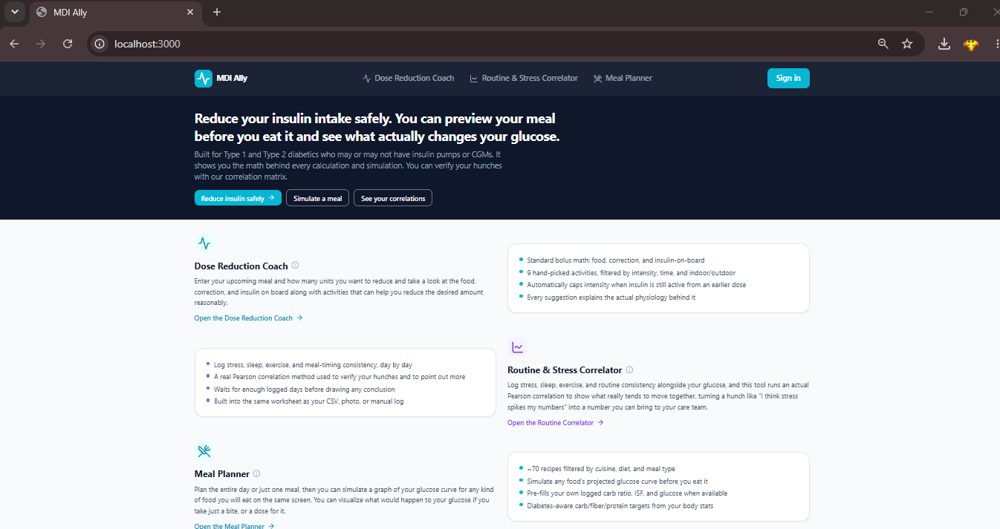

## Dose Reduction Activity Coach

In the "Your upcoming meal" section, you can input the carbs of what you want to eat, your carb ratio, current glucose, target glucose, ISF, and how many units you want to reduce in 0.5 multiples. If you don't what your ISF is, you can click on the "Don't know your ISF or carb ratio?" section, where it will ask you about your total daily dose to calculate for ISF and carb ratio, which you can import.

The "Previous dose" section is optional, however it is advised to input that information, as it helps to prevent hypos or hypers by accounting for Insulin on Board, which is the amount of insulin already in your body. You can input the units you gave for that dose, how many minutes it has been since that dose, and the duration of insulin action(2-4 hours for rapid on average).

In the "Your preferences" section, you can set your comfortable intensity to Light, Medium, or Vigorous, and how much time you can allot to such activities, along with your preferred setting of outdoor, indoor, or both. 

The "How much you can reasonably reduce" section tells you how many units you should reduce while preventing a projected hyper, it does the calculation based on the data that is given in the "Your upcoming meal" and "Previous dose". 

The "Exercise time needed" tells you how many minutes of each respective intensity tier of activities is required to reduce the amount of insulin you desire. 

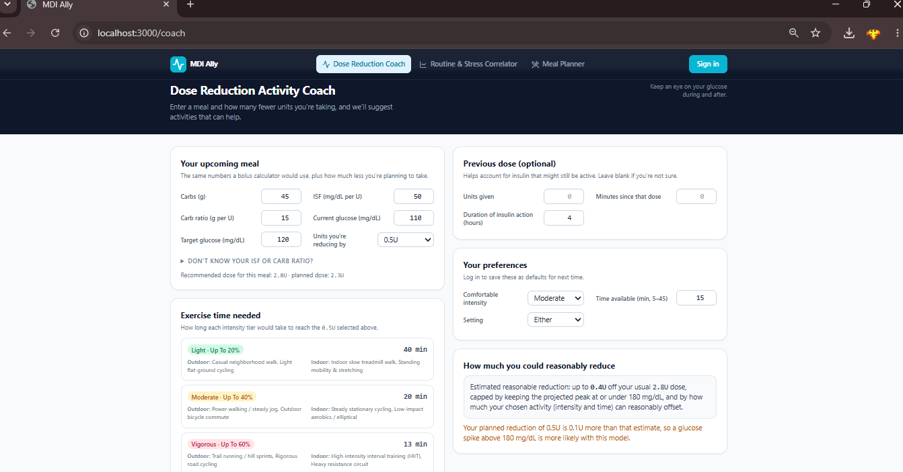

After you are done with all of that which shouldn't take much time, you can scroll down to view which kind of activities can reduce the amount of insulin chose based on your preferred intensity. Each activity has a quick description on what to do, it also has a short explanation on what it does to reduce insulin. If you still have difficulty in understanding how to do exercise, you can click on "Watch a demo" which will take you to Youtube where you can watch a video regarding it. 

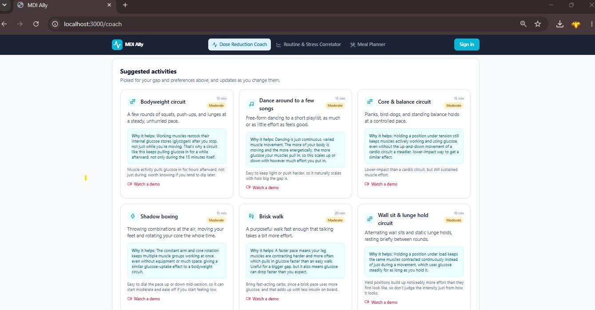

## Routine & Stress Correlator

In this section, you can upload your Medtronic Carelink CSV(if you have one), Photo or CSV of a manual log, or you can manually log entries.

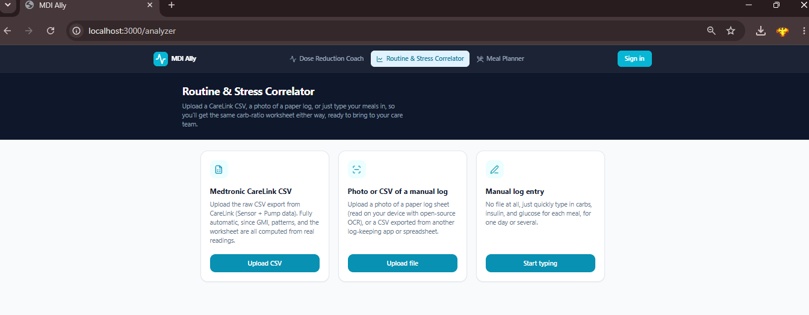

Once you upload your data, or type it in, it will show you the respective stats. It will show you your average glucose, GMI, Hba1c, and coefficient of variation. It also shows you your hyper and hypoglycemic patterns along withs frequencies and timings. 

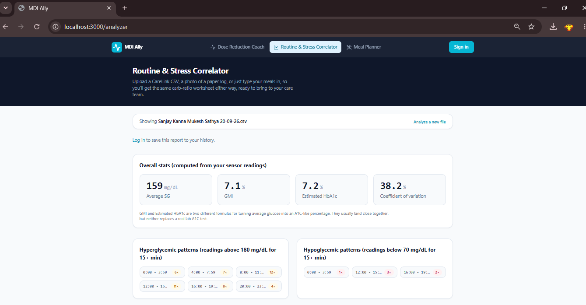

You can then scroll down to the suggested carb ratio section, there you can input your target glucose level rise over 2 hours. You can select the meal type(breakfast, lunch, dinner, etc.) to analyze/edit carb ratio. It then shows you your average stats for that meal type, along with the suggested carb ratio, and an experiment ratio. It shows you the graph of your current ratio and what its doing to your blood glucose. The graph also shows you your projected gluocse if you were to use the suggested ratio, and you can play with the experiment ratio to see for yourself, what would happen to your glucose level. 

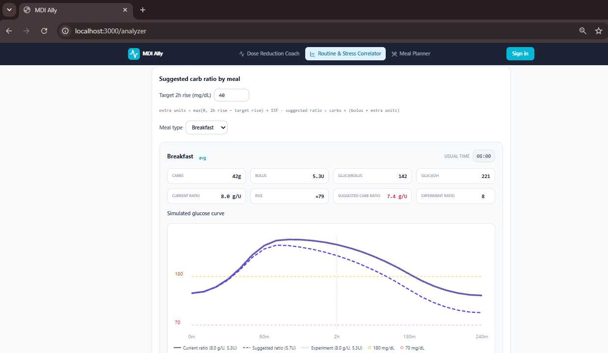

You can further scroll down to see a day-by-day breakdown of your glucose levels, especially your best and worst days. You can change the stress, sleep, exercise, and routine from 1-5, which translates from bad to good. This allows you to view the correlation matrix to show which factors may have correlated to your gluocse levels that day. It can show you what causes your glucose levels to fluctuate, and what causes it to be stable. Furthermore, you can select a day from the breakdown to send to meal planner. 

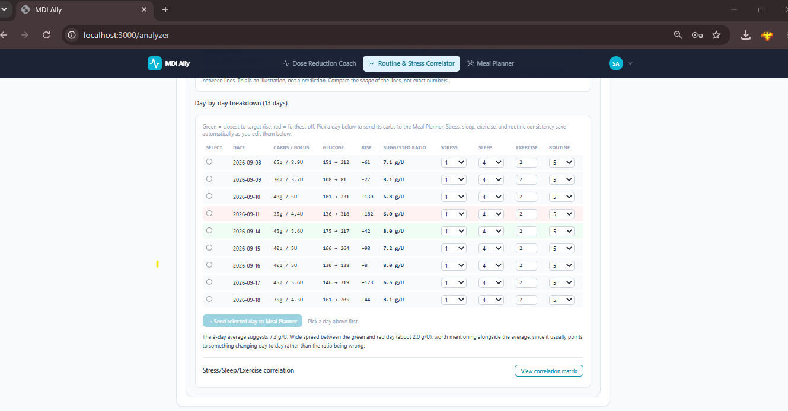

## Meal Planner

After you import the data from before, or even simply navigating to the "Meal Planner" page. There you can set your daily plan with target carbs, fiber, and protein. If you don't what to set it as, you can click on "Estimate from body stats", where it will ask you your weight and height to calculate on average, how much carbs, protein, and fiber you need. You can also use the filter accordingly with what kind of cusines, meal type, dietary preferences and subtypes. 

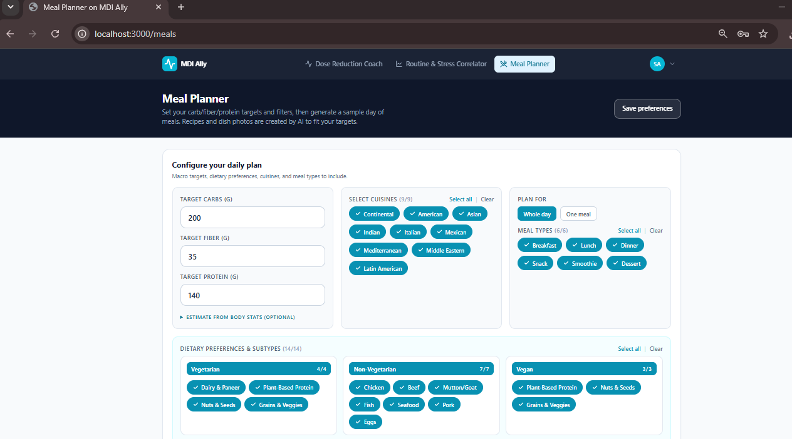

Then you can check out your upcoming meal for simulation. But most importantly, our AI will suggest you food based on the filters you chose. Each meal tells you how much carb, protein, and fiber it has. 

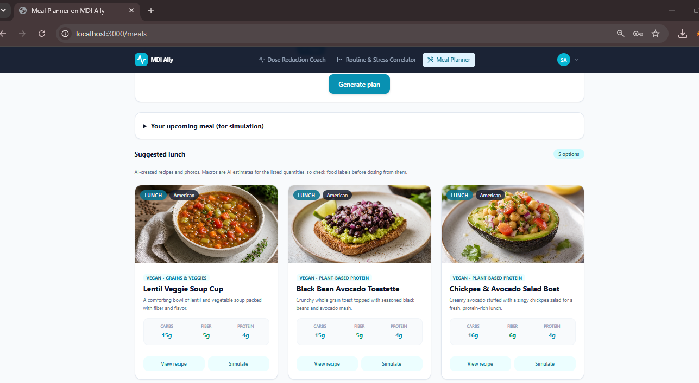

You can click on "View recipe" from the options, and you will see the ingredients required and instructions on how to make that particular food. 

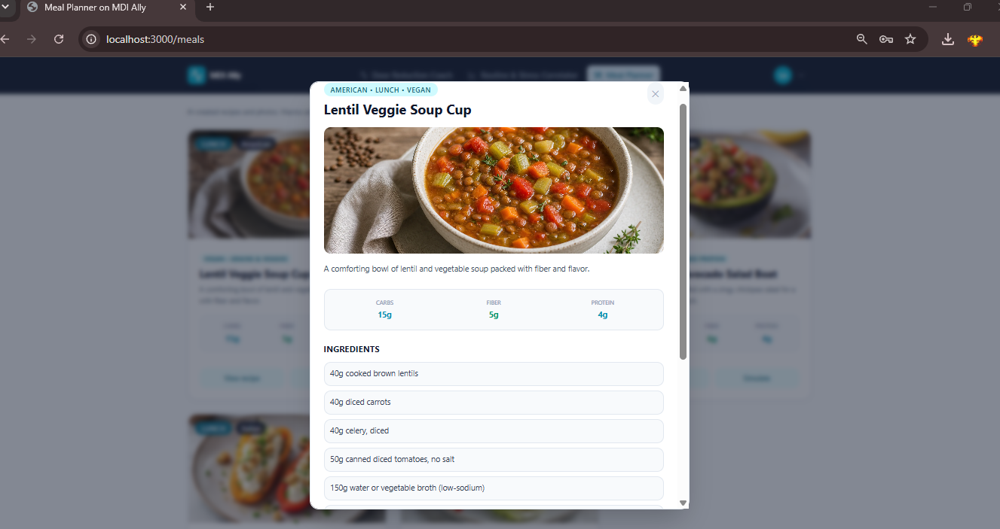

You can also click on "Simulate" where you can edit the carb ratio, ISF, and current glucose to see a graph that predicts what will happen when you consume that particular food, along with projected peaks.

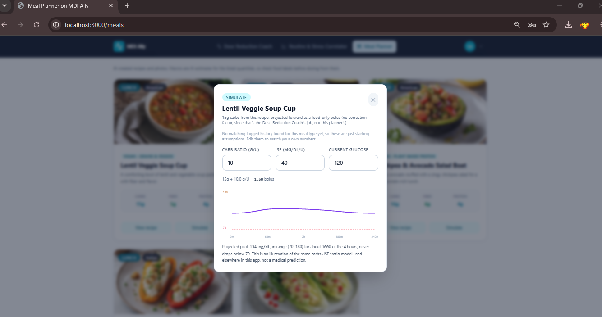
